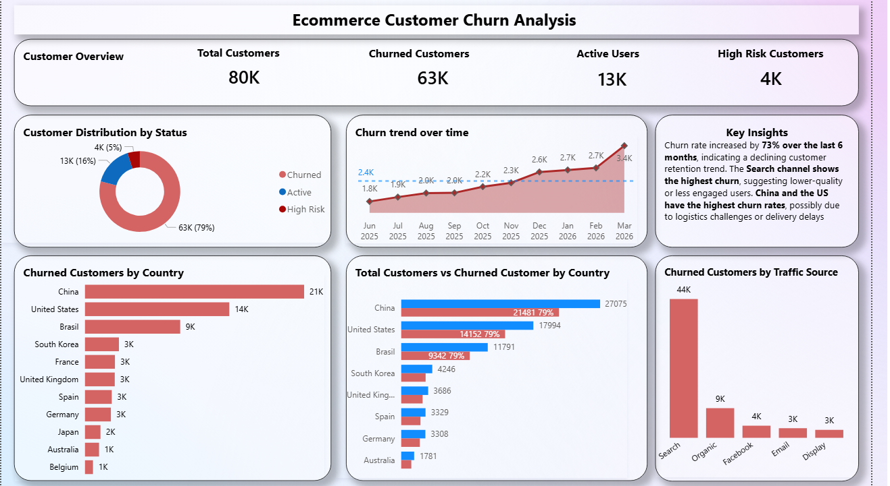

# Customer Churn Analysis Dashboard

## Tools Used
- Power BI
- SQL
- Google BigQuery
- DAX
- Data Modeling

## Project Overview
Developed an end-to-end customer churn analysis dashboard to identify retention risks and support data-driven decision-making.

The project analyzes customer churn trends, traffic source behavior, regional patterns, and KPI performance over time.

## Key KPIs
- Total Customers
- Churned Customers
- Churn Rate
- Retention Rate

## Key Insights
- Churn increased over the last 6 months.
- Certain traffic sources showed higher churn.
- Regional differences were observed in customer behavior.
- The dashboard helps identify high-risk customer segments.

## Business Impact
This dashboard can help business teams monitor churn, understand customer behavior, and support targeted retention strategies.

## Dashboard Preview
# customer-churn-analysis
Customer churn analysis dashboard using BigQuery, SQL, and Power BI
